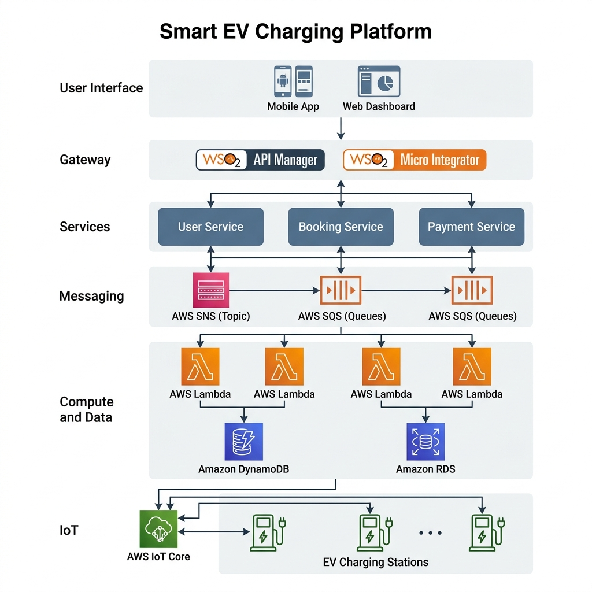

# Smart EV Charging Orchestration Platform

[](https://aws.amazon.com/)
[](https://wso2.com/)
[](https://opensource.org/licenses/MIT)

## 🌟 Project Overview

The **Smart EV Charging Orchestration Platform** is an enterprise-grade, cloud-native solution designed to manage the growing complexities of Electric Vehicle (EV) charging infrastructure. By leveraging **AWS serverless computing** and **WSO2 API orchestration**, the platform provides a scalable, secure, and highly available system for grid-aware charging management.

---

## 🏗 System Architecture (v2)

The system has evolved into a robust **Microservices & Event-Driven Architecture**. This design ensures high availability, independent scalability, and fault tolerance across all business domains.



### Key Architectural Concepts
- **API First**: All system capabilities are exposed via standardized RESTful APIs secured by **WSO2 API Manager**.
- **Event-Driven**: Asynchronous communication between services is handled by **AWS SNS/SQS**, decoupling high-traffic IoT ingestion from business logic.
- **Domain-Driven Design**: The system is split into specialized microservices (User, Booking, Payment, Charging).

> [!TIP]
> For a detailed breakdown of our design choices, refer to the [Architectural Decision Records (ADR)](docs/adr.md).

---

## 🛠 Core Services

- **User Service**: Manages profiles, vehicle registration, and identity.
- **Booking Service**: Handles reservation logic and station availability tracking.
- **Payment Service**: Processes financial transactions and manages the billing ledger.
- **Charging Service**: Manages real-time IoT interaction with charging hardware via **AWS IoT Core**.

---

## 🎯 Architectural Goals (AWS Well-Architected)

- **Security**: Zero-trust approach using WSO2 OAuth2/OIDC and AWS IAM.
- **Reliability**: Decoupled messaging (SQS) permits services to fail and recover without system-wide impact.
- **Performance Efficiency**: Serverless Lambda functions scale instantly to meet charging demand.
- **Cost Optimization**: Pay-as-you-go pricing for compute and storage (DynamoDB/RDS).
- **Operational Excellence**: Automated deployment and comprehensive ADR documentation.

---

## 📂 Project Structure

```text
├── docs/               # Architecture v2, System Design (Refined), API Specs, ADRs
├── infra/              # Infrastructure as Code (Planned)
├── services/           # Microservices source code (Day 3+)
├── wso2/               # WSO2 MI/APIM configuration files
└── .github/            # CI/CD Workflows
```

---

## 📈 Project Status

- **Day 1**: Foundation, initial documentation, and v1 architecture. ✅
- **Day 2**: Advanced architecture design, Microservices decomposition, and ADR documentation. ✅

---

## 🚀 Next Steps

- [ ] Implementation of the `booking-service` and `payment-service` core logic.
- [ ] Development of the WSO2 Micro Integrator sequences for service orchestration.
- [ ] Initial Terraform scripts for AWS messaging and database infrastructure.

---

## 📄 License

This project is licensed under the MIT License - see the LICENSE file for details.
