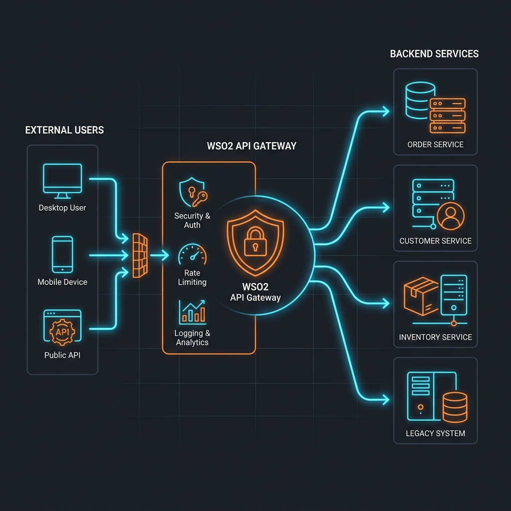

# Smart EV Charging Orchestration Platform

[](https://aws.amazon.com/)
[](https://wso2.com/)
[](https://opensource.org/licenses/MIT)

## 🌟 Project Overview

The **Smart EV Charging Orchestration Platform** is an enterprise-grade, cloud-native solution designed to manage the growing complexities of Electric Vehicle (EV) charging infrastructure. By leveraging **AWS serverless computing** and **WSO2 API orchestration**, the platform provides a scalable, secure, and highly available system for grid-aware charging management.

---

## 🏗 System Architecture (v3)

The system features an Enterprise API Gateway layer protecting robust **Microservices & Event-Driven Architecture**. This design ensures secure routing, independent scalability, and fault tolerance.



### Key Architectural Concepts
- **API First**: All system capabilities are exposed via standardized RESTful APIs secured by **WSO2 API Manager**.
- **Event-Driven**: Asynchronous communication between services is handled by **AWS SNS/SQS**, decoupling high-traffic IoT ingestion from business logic.
- **Domain-Driven Design**: The system is split into specialized microservices (User, Booking, Payment, Charging).

> [!TIP]
> For a detailed breakdown of our design choices, refer to the [Architectural Decision Records (ADR)](docs/adr.md).

---

## 🛠 Core Services

- **User Service**: Manages profiles, vehicle registration, and identity.
- **Booking Service**: Handles reservation logic and station availability tracking.
- **Payment Service**: Processes financial transactions and manages the billing ledger.
- **Charging Service**: Manages real-time IoT interaction with charging hardware via **AWS IoT Core**.

---

## 🎯 Architectural Goals (AWS Well-Architected)

- **Security**: Zero-trust approach using WSO2 OAuth2/OIDC and AWS IAM.
- **Reliability**: Decoupled messaging (SQS) permits services to fail and recover without system-wide impact.
- **Performance Efficiency**: Serverless Lambda functions scale instantly to meet charging demand.
- **Cost Optimization**: Pay-as-you-go pricing for compute and storage (DynamoDB/RDS).
- **Operational Excellence**: Automated deployment and comprehensive ADR documentation.

---

## 📂 Project Structure

```text
├── docs/               # Architecture v2, System Design, API Specs, ADRs, Infra Docs
├── infra/              # Infrastructure as Code (Terraform)
├── services/           # Microservices source code (Day 3+)
├── wso2/               # WSO2 MI/APIM configuration files
└── .github/            # CI/CD Workflows
```

---

## 🏗 Infrastructure Setup

The platform's infrastructure is managed using **Terraform (Infrastructure as Code)**. This ensures consistency and reliability across different environments.

### Cloud Components
- **Networking**: VPC, Public Subnets, Internet Gateway.
- **Compute**: AWS EC2 (t2.micro - Free Tier).
- **Storage**: Amazon S3 for logs and persistent data.
- **Security**: IAM Roles for least-privilege access and Security Groups for network isolation.

For detailed deployment instructions, refer to the [Infrastructure Documentation](infra/terraform/README.md).

---

## 🚀 Backend Implementation

The platform's core logic is handled by a Node.js microservice.

### API Endpoints
- **GET `/stations`**: Real-time charging station availability.
- **POST `/booking`**: Reservation management.
- **POST `/payment`**: Transaction processing simulation.

This service is ready for **WSO2 API Gateway** integration. For more details, see the [Backend Documentation](services/backend/README.md).

---

## 🛡️ API Management with WSO2

The platform uses **WSO2 API Manager** to securely expose backend microservices to external developers and applications.

### Key API Governance Features
- **Security Implementation**: All endpoints are protected via strict **OAuth2/JWT** bearer tokens, preventing unauthorized access to sensitive `/payment` routes.
- **Rate Limiting (Throttling)**: Precise restriction of requests per minute per user (e.g., Bronze, Silver, Gold plans) to prevent backend exhaustion and DDoS attacks.
- **API Lifecycle**: APIs are strictly versioned and managed through states (Created, Published, Deprecated) to prevent breaking changes for existing integrations.
- **Enterprise Benefits**: Centralized logging, monetization potential, and isolation between internal backend logic and external consumer interactions.

---

## 📈 Project Status

- **Day 1**: Foundation, initial documentation, and v1 architecture. ✅
- **Day 2**: Advanced architecture design, Microservices decomposition, and ADR documentation. ✅
- **Day 3**: Infrastructure as Code (IaC) implementation with Terraform. ✅
- **Day 4**: Backend Services & API Implementation (Node.js/Express). ✅
- **Day 5**: WSO2 API Management & Integration Layer Setup. ✅

---

## 🚀 Next Steps

- [ ] Transitioning from in-memory storage to **Amazon DynamoDB/RDS**.
- [ ] Integration of messaging queues (**AWS SQS**) for event-driven orchestration.

---

## 📄 License

This project is licensed under the MIT License - see the LICENSE file for details.
